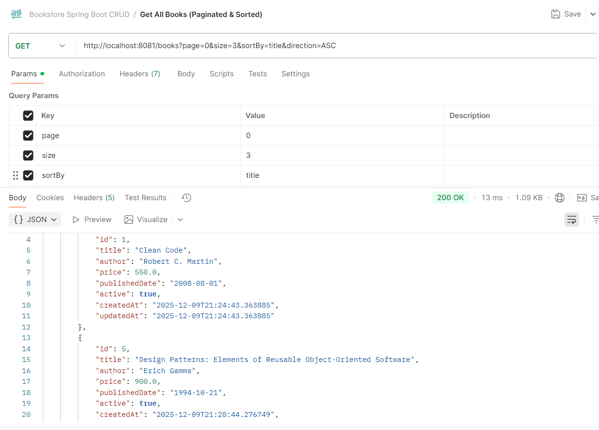
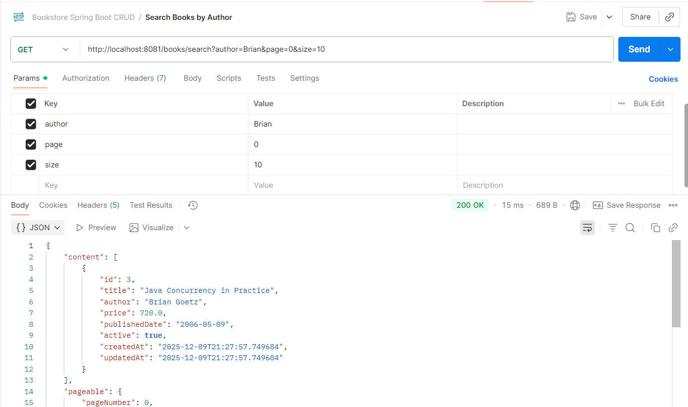

# 📚 Bookstore Management System – Spring Boot CRUD Application

A simple and production-ready **Bookstore Management System** built using **Spring Boot**, **MySQL**, and **REST APIs**.  
This project demonstrates backend development skills including CRUD operations, layered architecture, validations, pagination, exception handling, and more.

---

## 🚀 Features

| Feature | Description |
|--------|-------------|
| Create Book | Add new books with details like title, author, price, published date |
| View All Books | Supports pagination & sorting |
| Search Books | Search by title or author |
| Update Book | Modify existing book details |
| Soft Delete | Deactivate books instead of deleting from DB |
| Hard Delete | Permanently delete book from DB |
| Validations | Field-level validation using Jakarta Validation |
| Global Exception Handling | Elegant error responses using Controller Advice |

---

## 🏗️ Tech Stack

- **Java 21**
- **Spring Boot 3**
- **Spring Data JPA**
- **MySQL**
- **Hibernate**
- **RESTful APIs**
- **Lombok** (boilerplate removal)
- **Maven**

---

## 📁 Project Structure

```text
src/main/java/com/example/bookstore
│
├─ controller        # REST API layer
├─ service           # Business logic
│  └─ impl           # Service implementation
├─ repository        # JPA repository interfaces
├─ entity            # JPA entities (Book)
├─ exception         # Custom exceptions
└─ advice            # Global exception handler
```

## 🔍 API Testing Screenshots

### 1️⃣ Create Book


### 2️⃣ Get All Books (Pagination & Sorting)


### 3️⃣ Get Book by ID


### 4️⃣ Search Books by Author


### 5️⃣ Search Books by Title

